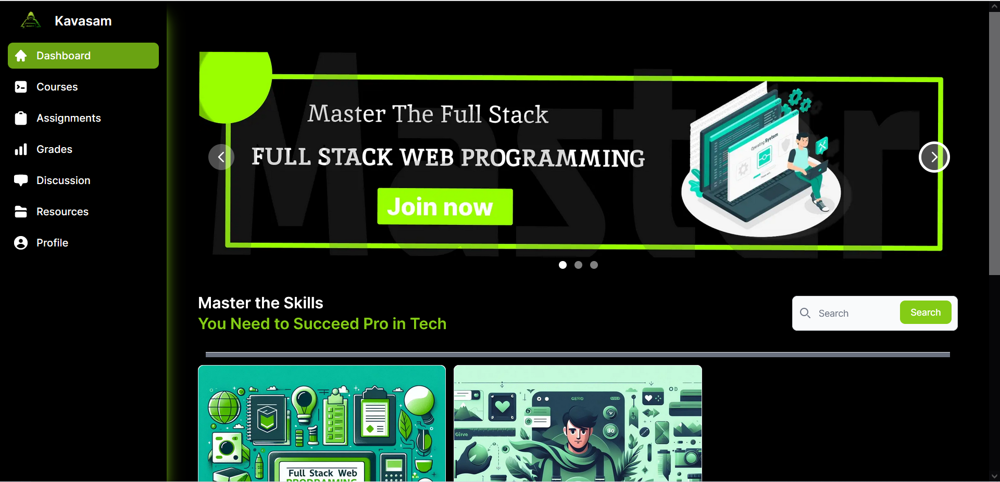

# Edutech Platform

## Description

This is an Edutech platform designed to provide online learning resources and tools. It aims to make education more accessible and engaging through the use of technology.

## Features

- Course Catalog: A wide range of courses available in various fields.
- Interactive Lessons: Engaging and interactive lessons to enhance learning.
- Assessments: Quizzes and assignments to test understanding and knowledge.
- Progress Tracking: Track your learning progress and achievements.
- Discussion Forums: Collaborate and discuss with peers and instructors.

## Installation

Provide instructions on how to install your platform here.

## Usage

Provide instructions on how to use your platform here.

## Contributing

We welcome contributions from the community. Please read our [contribution guidelines](CONTRIBUTING.md) before getting started.

## License

This project is licensed under the [MIT License](LICENSE).

## Contact

If you have any questions, feel free to reach out to us at [email](mailto:harishkumarsp023@gmail.com).